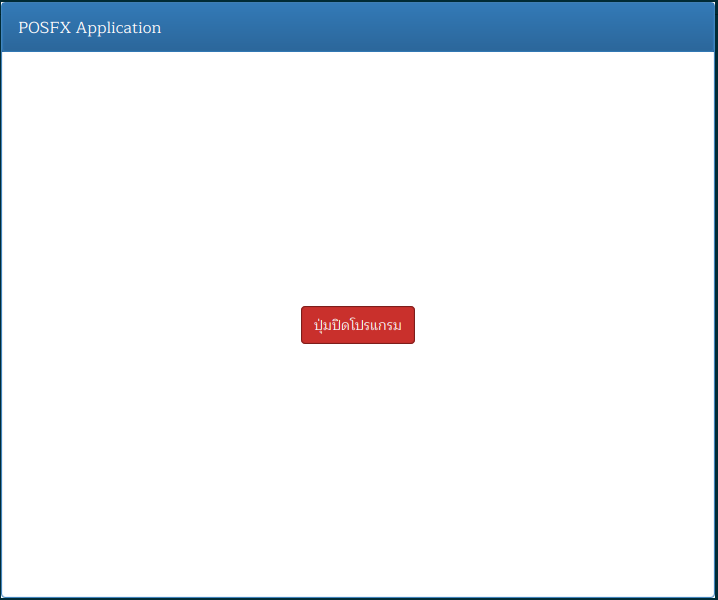
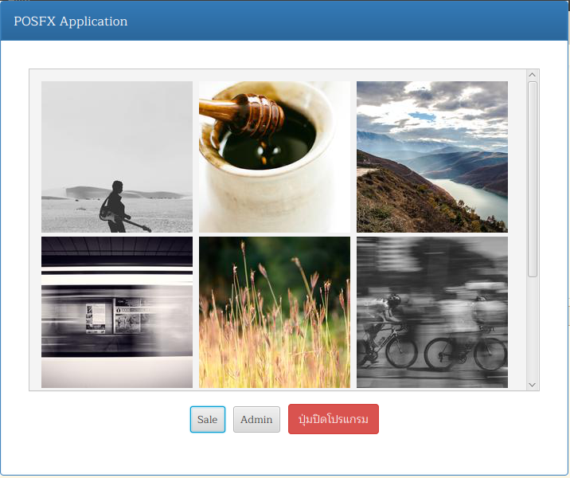
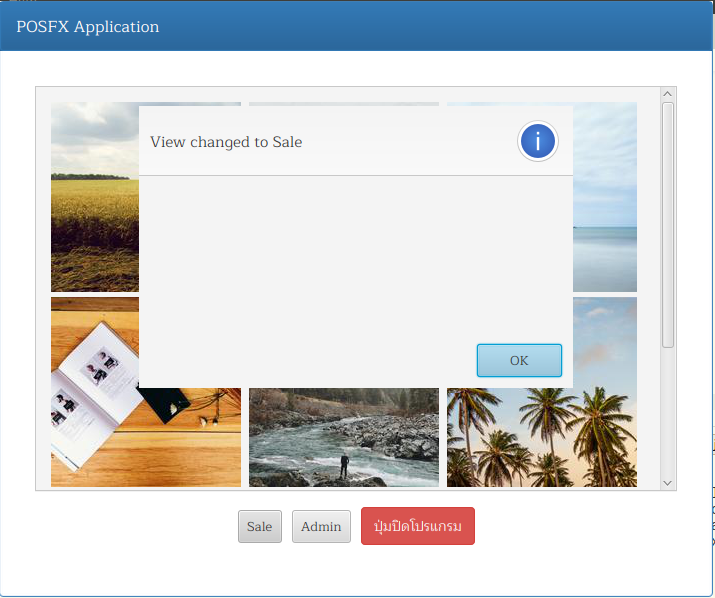
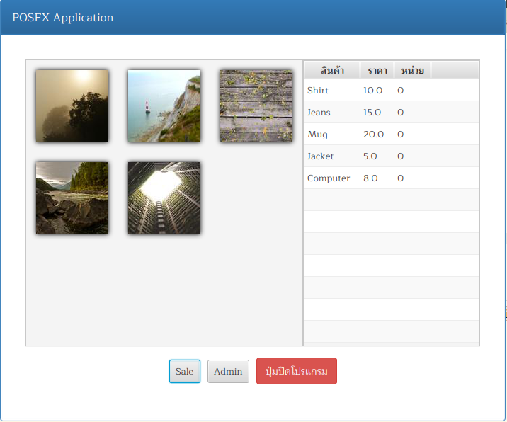
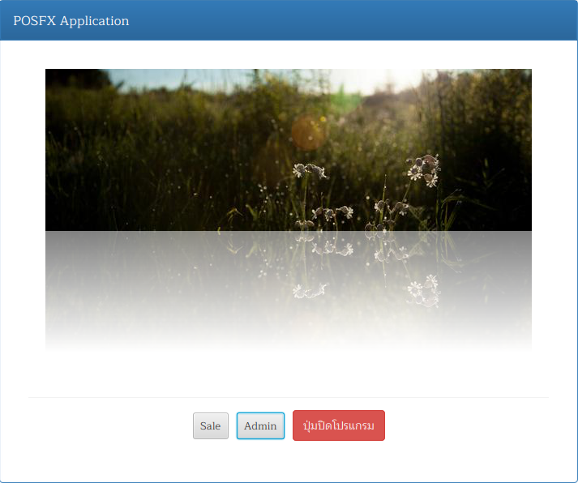

# posfx

Tutorial project for creating POS application with javafx

# เครื่องมือในการพัฒนา

- [JDK 13](http://jdk.java.net/13/)
- [JavaFX 13](https://openjfx.io/)
- [Gradle](https://gradle.org/)
- [Visual Studio Code](https://code.visualstudio.com/Download)


# วิธี run

```sh
gradlew run
```

# Step 02

ปรับใช้ bootstrap style

[BootstrapFX](https://github.com/kordamp/bootstrapfx)

## 2.1 แก้ไข build.gradle

```groovy
repositories {
    mavenCentral()
    jcenter()
}

javafx {
    version = "13"
    modules = [ 'javafx.controls' ]
}

dependencies {
    compile 'org.kordamp.bootstrapfx:bootstrapfx-core:0.2.4'
}
```

## 2.2 ปรับ POSFX.java

```java
import javafx.application.Application;
import javafx.geometry.Insets;
import javafx.scene.Scene;
import javafx.scene.control.Button;
import javafx.scene.layout.BorderPane;
import javafx.stage.Stage;

import org.kordamp.bootstrapfx.scene.layout.Panel;


public class POSFX extends Application {
    final String title = "POSFX Application";

    @Override
    public void start(final Stage stage) throws Exception {
        Panel panel = new Panel(title);
        panel.getStyleClass().add("panel-primary");
        BorderPane content = new BorderPane();
        content.setPadding(new Insets(20));
        Button button = new Button("ปุ่มปิดโปรแกรม");
        button.getStyleClass().setAll("btn","btn-danger");
        button.setOnAction( (e) -> {
            stage.close();
        });
        content.setCenter(button);
        panel.setBody(content);

        Scene scene = new Scene(panel, 640, 480);
        scene.getStylesheets().add("org/kordamp/bootstrapfx/bootstrapfx.css");

        stage.setTitle(title);
        stage.setScene(scene);
        stage.show();
    }
}
```

# ผลลัพธ์



# Step 03

จัด layout สำหรับแสดง รายการสินค้าโดยใช้ BorderPane, GridPane, HBox, ImageView



# Step 04

จัดกลุ่มแยกคลาส เพิ่ม interface 



# Step 05

ปรับ SaleView เพิ่ม AdminView และ Product


